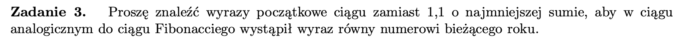

```python
def Zadanie_3():
    rok = 2024
    best = (rok - 1, 1)

    for i in range(1, rok + 1):
        x = i
        y = rok
        while y > x:
            x, y = y - x, x
        if x + y < sum(best):
            best = (x, y)
    print(best)


if __name__ == "__main__":

    Zadanie_3()

```