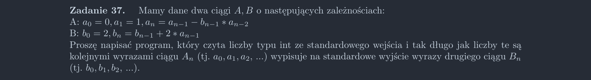

<picture>
  <source srcset="../../srt/zbior_zadan/37.png" media="(prefers-color-scheme: light)">
  <source srcset="../../srt/zbior_zadan/black_37.png" media="(prefers-color-scheme: dark)">
  
</picture>

```python
def Zadanie_37():
    a0, a1 = 0, 1
    b0 = 2
    b1 = b0 + 2 * a0

    if int(input()) == a0:
        print("b", b0)
    else:
        exit()

    while int(input()) == a1:
        print("b", b1)

        a0, a1 = a1, a1 - b1 * a0
        b0, b1 = b1, b1 + 2 * a0


```