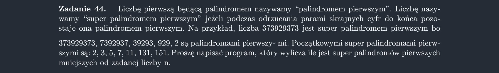

<picture>
  <source srcset="../../srt/zbior_zadan/44.png" media="(prefers-color-scheme: light)">
  <source srcset="../../srt/zbior_zadan/black_44.png" media="(prefers-color-scheme: dark)">
  
</picture>

```python
from math import sqrt


def isprime(n):
    if n < 2:
        return False
    if n < 4:
        return True
    if n % 2 == 0 or n % 3 == 0 or n % 5 == 0:
        return False

    for i in range(7, int(sqrt(n) + 1), 6):
        if n % i == 0:
            return False
    return True


def Zadanie_44(N):
    def nowe_brzegi(srodek, dlugosci):
        for i in range(10):
            nowy_srodek = (10**dlugosci * i + srodek) * 10 + i
            if nowy_srodek < N and isprime(nowy_srodek):
                print(nowy_srodek)
                nowe_brzegi(nowy_srodek, dlugosci + 2)

    for i in range(min(N, 10)):
        if isprime(i):
            print(i)
            nowe_brzegi(i, 1)

    for i in range(10, min(N, 100)):
        if i % 10 == i // 10 and isprime(i):
            print(i)
            nowe_brzegi(i, 2)

```