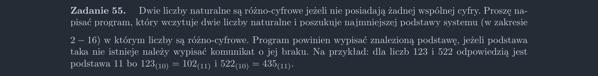

<picture>
  <source srcset="../../srt/zbior_zadan/55.png" media="(prefers-color-scheme: light)">
  <source srcset="../../srt/zbior_zadan/black_55.png" media="(prefers-color-scheme: dark)">
  
</picture>

```python
# rozwiazanie z wiki ale posiada tablice


def common_digit(a, b, s):
    tab = [False for _ in range(s)]

    while a != 0:
        tab[a % s] = True
        a = a // s
    # end while

    while b != 0:
        if tab[b % s]:
            return False
        b = b // s
    # end while
    return True


def Zadanie_55(a, b):
    for s in range(2, 17):
        if common_digit(a, b, s):
            print(s)
            break
    else:
        print("brak")


```