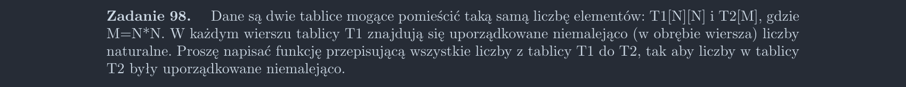

<picture>
  <source srcset="../../srt/zbior_zadan/098.png" media="(prefers-color-scheme: light)">
  <source srcset="../../srt/zbior_zadan/black_098.png" media="(prefers-color-scheme: dark)">
  
</picture>

```python
def Zadanie_98(T1, T2):
    indeks_T2 = 0  # Początkowy indeks dla T2
    for tab in T1:
        for element in tab:
            k = indeks_T2 - 1
            while k >= 0 and T2[k] > element:
                T2[k + 1] = T2[k]
                k -= 1
            T2[k + 1] = element
            indeks_T2 += 1

    return T2


```