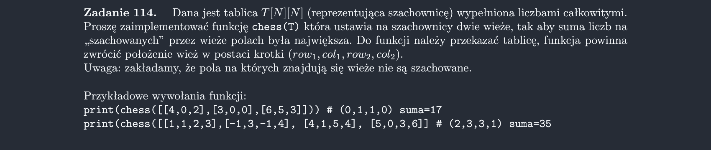

<picture>
  <source srcset="../../srt/zbior_zadan/114.png" media="(prefers-color-scheme: light)">
  <source srcset="../../srt/zbior_zadan/black_114.png" media="(prefers-color-scheme: dark)">
  
</picture>

```python
import copy


def chess(tab):
    n = len(tab)
    best = float("-inf")
    best_positions = None

    for x in range(n):
        for y in range(n):

            suma_1 = 0
            tablica_z_wieza = copy.deepcopy(tab)
            tablica_z_wieza[x][y] = 0
            for x1 in range(0, n):
                suma_1 += tablica_z_wieza[x1][y]
                tablica_z_wieza[x1][y] = 0

            for y1 in range(0, n):
                suma_1 += tablica_z_wieza[x][y1]
                tablica_z_wieza[x][y1] = 0

            for a in range(x, n):
                for b in range(0, n):
                    if a == x and b == y:
                        continue
                    elif a == x or b == y:
                        suma_2 = -tab[a][b]
                    else:
                        suma_2 = 0

                    tablica_z_wieza[a][b] = 0

                    for a1 in range(0, n):
                        suma_2 += tablica_z_wieza[a1][b]

                    for b1 in range(0, n):
                        suma_2 += tablica_z_wieza[a][b1]

                    if suma_1 + suma_2 > best:
                        best = suma_2 + suma_1
                        best_positions = (x, y, a, b)

    return best_positions


```