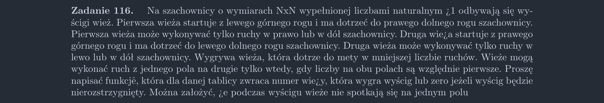

<picture>
  <source srcset="../../srt/zbior_zadan/116.png" media="(prefers-color-scheme: light)">
  <source srcset="../../srt/zbior_zadan/black_116.png" media="(prefers-color-scheme: dark)">
  
</picture>

```python
def czy_wzglednie_pierwsze(a, b):
    def nwd(a, b):
        while b:
            a, b = b, a % b
        return a

    return nwd(a, b) == 1


def liczba_ruchow(T, kierunek_kolumn, start):
    n = len(T)

    def rek(x, y, ostatni_ruch):
        # Sprawdzenie, czy wieża dotarła do mety.
        if x == n - 1 and (y == n - 1 or y == 0):
            return 0

        # Ruch w dół.
        wartosc_ruch_dol = float("inf")
        if x + 1 < n and czy_wzglednie_pierwsze(T[x][y], T[x + 1][y]):
            wartosc_ruch_dol = rek(x + 1, y, "dol")
            if ostatni_ruch != "dol":
                wartosc_ruch_dol += 1

        # Ruch w lewo/prawo.
        wartosc_ruch_bok = float("inf")
        if 0 <= y + kierunek_kolumn < n and czy_wzglednie_pierwsze(
            T[x][y], T[x][y + kierunek_kolumn]
        ):
            wartosc_ruch_bok = rek(x, y + kierunek_kolumn, "bok")
            if ostatni_ruch != "bok":
                wartosc_ruch_bok += 1

        return min(wartosc_ruch_dol, wartosc_ruch_bok)

    return rek(start[0], start[1], None)


def Zadanie_116(T):
    wynik_1_wieza = liczba_ruchow(T, 1, (0, 0))
    wynik_2_wieza = liczba_ruchow(T, -1, (0, len(T) - 1))

    if wynik_1_wieza > wynik_2_wieza:
        return 2
    elif wynik_1_wieza < wynik_2_wieza:
        return 1
    else:
        return 0


```