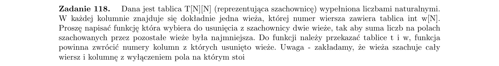

```python
def Zadanie_118(T, w):
    """
    Wystarczy tylko sprawdzać przecięcia wież. Są to jedyne pola, które po usunięciu wież przestaną być szachowane.
    Należy więc znaleźć maksymalną sumę tych dwóch przecięć.
    """

    n = len(w)
    res = (0, 0)
    max_nie_szachowanych = 0
    for w1 in range(n):
        for w2 in range(w1 + 1, n):
            nie_szachowane = T[w[w1]][w2] + T[w[w2]][w1]
            if nie_szachowane > max_nie_szachowanych:
                max_nie_szachowanych = nie_szachowane
                res = (w1, w2)

    return res

```