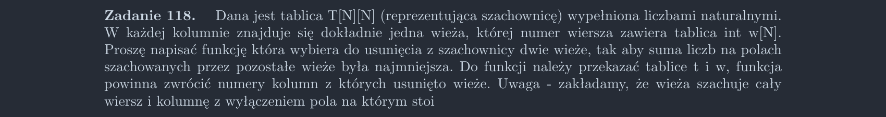

<picture>
  <source srcset="../../srt/zbior_zadan/118.png" media="(prefers-color-scheme: light)">
  <source srcset="../../srt/zbior_zadan/black_118.png" media="(prefers-color-scheme: dark)">
  
</picture>

# Wizualizacja Rozwiązania:

Po usunięciu dwóch wież cztery pola stają się nieschowane, ale na dwóch z nich wcześniej stały wieże, więc i tak nie były szachowane. 

Jedynymi polami, które przestają być szachowane, są przecięcia, więc należy znaleźć maksymalne z tych przecięć.


<div align="center">
  <video src="https://github.com/user-attachments/assets/ecf4c419-e22e-442b-8a9c-0efad6fea3d2" width="400" />
</div>

program Wizualizacji w rozwiązaniach pod nazwa `pomoc_szachowania` można sie pobawić

# Rozwiązanie:

```python
def Zadanie_118(T, w):
    n = len(w)
    res = (0, 0)
    max_nie_szachowanych = 0
    for w1 in range(n):
        for w2 in range(w1 + 1, n):
            nie_szachowane = T[w[w1]][w2] + T[w[w2]][w1]
            if nie_szachowane > max_nie_szachowanych:
                max_nie_szachowanych = nie_szachowane
                res = (w1, w2)

    return res
```


