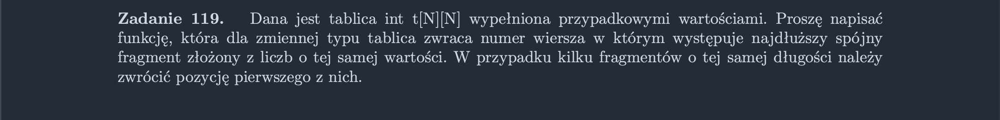

<picture>
  <source srcset="../../srt/zbior_zadan/119.png" media="(prefers-color-scheme: light)">
  <source srcset="../../srt/zbior_zadan/black_119.png" media="(prefers-color-scheme: dark)">
  
</picture>

```python
def Zadanie_119(t):
    max_len = 0
    max_row = -1

    for i in range(len(t)):
        current_value = None
        current_length = 0
        max_current_len = 0

        for j in range(len(t[i])):
            if t[i][j] == current_value:
                current_length += 1
            else:
                current_value = t[i][j]
                current_length = 1

            if current_length > max_current_len:
                max_current_len = current_length

        if max_current_len > max_len:
            max_len = max_current_len
            max_row = i

    return max_row


```