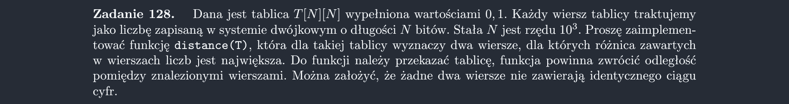

<picture>
  <source srcset="../../srt/zbior_zadan/128.png" media="(prefers-color-scheme: light)">
  <source srcset="../../srt/zbior_zadan/black_128.png" media="(prefers-color-scheme: dark)">
  
</picture>

```python
# https://github.com/MarcinSerafin03/bit-algo-start-24-25-WDI/tree/main


def bin_to_deci(row):
    res = 0
    exp = 0
    for i in range(len(row) - 1, -1, -1):
        res += 2**exp * row[i]
        exp += 1
    return res


def bigger(row1, row2):
    l = len(row1)
    for i in range(l):
        if row1[i] > row2[i]:
            return True
        elif row1[i] < row2[i]:
            return False
    return True


def distance(T):
    mini_ind = 0
    maxi_ind = 0
    for i in range(len(T)):
        if bigger(T[i], T[maxi_ind]):
            maxi_ind = i
        if bigger(T[mini_ind], T[i]):
            mini_ind = i

    return bin_to_deci(T[maxi_ind]) - bin_to_deci(T[mini_ind])

```