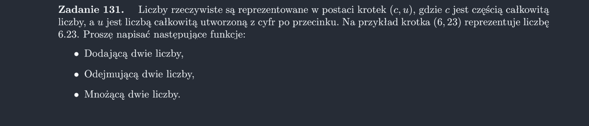

<picture>
  <source srcset="../../srt/zbior_zadan/131.png" media="(prefers-color-scheme: light)">
  <source srcset="../../srt/zbior_zadan/black_131.png" media="(prefers-color-scheme: dark)">
  
</picture>

```python

def dodaj(liczba1, liczba2):
    c1, u1 = liczba1
    l1 = float(str(c1) + "." + str(u1))
    c2, u2 = liczba2
    l2 = float(str(c2) + "." + str(u2))

    suma = str(l1 + l2)
    wc, wu = suma.split(".")

    return wc, wu


def odejmij(liczba1, liczba2):
    return dodaj(liczba1, ("-" + liczba2[0], liczba2[1]))


def pomnoz(liczba1, liczba2):
    c1, u1 = liczba1
    l1 = float(str(c1) + "." + str(u1))
    c2, u2 = liczba2
    l2 = float(str(c2) + "." + str(u2))

    suma = str(l1 * l2)
    wc, wu = suma.split(".")

    return wc, wu


```
