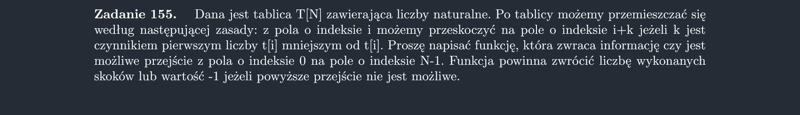

<picture>
  <source srcset="../../srt/zbior_zadan/155.png" media="(prefers-color-scheme: light)">
  <source srcset="../../srt/zbior_zadan/black_155.png" media="(prefers-color-scheme: dark)">
  
</picture>

```python
from math import sqrt


def prime(n):
    if n == 2 or n == 3:
        return True
    if n % 2 == 0 or n % 3 == 0 or n <= 1:
        return False
    i = 5
    while i <= sqrt(n) + 1:
        if n % i == 0:
            return False
        i += 2
        if n % i == 0:
            return False
        i += 4
    # end while
    return True


def czy_y_czynnikiem_pierwszym_x(y, x):
    return x % y == 0 and prime(y)


def Zadanie_155(T):
    N = len(T)

    def rek(T, i, cnt):
        nonlocal N
        if i == N - 1:
            return cnt

        k = 2
        ans = float("inf")
        while i + k < N:
            if czy_y_czynnikiem_pierwszym_x(k, T[i]):
                ans = min(ans, rek(T, i + k, cnt + 1))
            k += 1

        return ans

    ans = rek(T, 0, 0)

    return ans if ans != float("inf") else -1


```