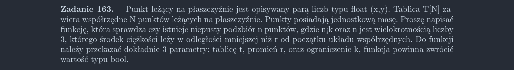

<picture>
  <source srcset="../../srt/zbior_zadan/163.png" media="(prefers-color-scheme: light)">
  <source srcset="../../srt/zbior_zadan/black_163.png" media="(prefers-color-scheme: dark)">
  
</picture>

```python
from math import sqrt


def odleglosci_srodka_ciezkosci(punkty):
    """Oblicza odległość środka ciężkości od początku układu współrzędnych."""
    n = len(punkty)
    x_sum, y_sum = 0, 0
    for x, y in punkty:
        x_sum += x
        y_sum += y
    return sqrt((x_sum / n) ** 2 + (y_sum / n) ** 2)


def kombinacje(n, k):
    """Generator z wykladu 1:07:47 https://drive.google.com/drive/folders/1mSY7AzI2HEKI3KE-FWHTG7V1AQEaQFLU"""
    if k == 1:
        for x in n: yield [x]
    elif len(n) == k:
        yield n
    else:
        for x in kombinacje(n[1:], k): yield x
        for x in kombinacje(n[1:], k - 1): yield [n[0]] + x


def Zadanie_163(t, r, k):
    """Generuje kombinacje podzbiorów o wielkości będącej wielokrotnością liczby 3."""
    wielokrotnosci = 3
    for n in range(wielokrotnosci, k + 1, wielokrotnosci):
        for kombinacja in kombinacje(t, n):
            if odleglosci_srodka_ciezkosci(kombinacja) < r:
                return True
    return False


```