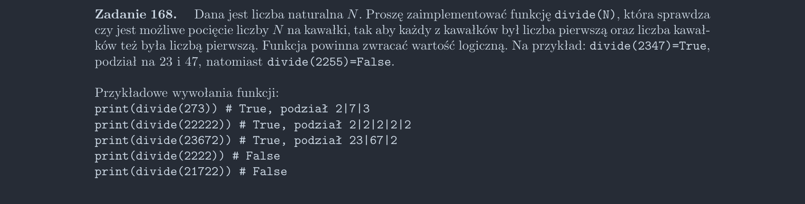

<picture>
  <source srcset="../../srt/zbior_zadan/168.png" media="(prefers-color-scheme: light)">
  <source srcset="../../srt/zbior_zadan/black_168.png" media="(prefers-color-scheme: dark)">
  
</picture>

```python
def is_prime(num):
    if num <= 1:
        return False
    if num == 2 or num == 3:
        return True
    if num % 2 == 0 or num % 3 == 0:
        return False

    for i in range(6, int(num**0.5) + 3, 6):
        if num % (i + 1) == 0 or num % (i - 1) == 0:
            return False

    return True


def rek(num, nums, i, parts):
    # print(num, nums, i, parts)

    if is_prime(num) and is_prime(parts):
        return True

    if i > num:
        return False

    if is_prime(num % i):
        if rek(num // i, [num % i] + nums, 10, parts + 1):
            return True

    return rek(num, [*nums], i * 10, parts)


def divide(N):
    return rek(N, [], 10, 1)

```