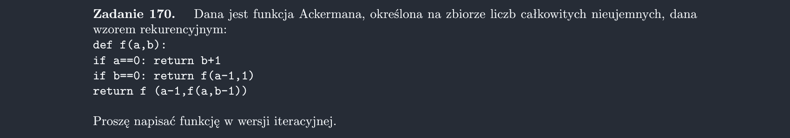

<picture>
  <source srcset="../../srt/zbior_zadan/170.png" media="(prefers-color-scheme: light)">
  <source srcset="../../srt/zbior_zadan/black_170.png" media="(prefers-color-scheme: dark)">
  
</picture>

```python
def Zadanie_170(a, b):
    """
    Kolejkowanie wywołań, będziemy tworzyć tablice `stos` która ma na ostanich 2 wartościach `a` i `b`.
    Wywołania są symulowane iteracyjnie poprzez odpowiednie manipulowanie stosu, aż do osiągnięcia końcowego wyniku.

    Stos początkowo zawiera dwie wartości: `a` i `b`.
    W każdej iteracji pobierane są dwie ostatnie wartości ze stosu.
    Na podstawie wartości `a` i `b` wyznaczane są nowe wartości
    i odkładane na stos, zgodnie z definicją funkcji Ackermanna:

    Proces trwa, dopóki na stosie nie zostanie tylko jedna wartość.
    """
    stos = [a, b]

    while len(stos) > 1:
        b, a = stos.pop(), stos.pop()

        if a == 0:
            stos.append(b + 1)
        elif b == 0:
            stos.append(a - 1)
            stos.append(1)
        else:
            stos.append(a - 1)
            stos.append(a)
            stos.append(b - 1)

    return stos[0]

```