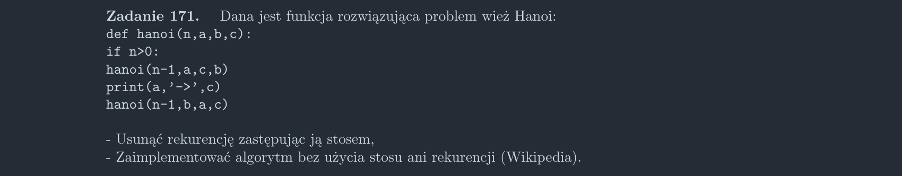

<picture>
  <source srcset="../../srt/zbior_zadan/171.png" media="(prefers-color-scheme: light)">
  <source srcset="../../srt/zbior_zadan/black_171.png" media="(prefers-color-scheme: dark)">
  
</picture>

```python
def hanoi(n, a, b, c):
    if n > 0:
        hanoi(n - 1, a, c, b)  # Przenieś n-1 krążków z a na b
        print(a, "->", c)  # Przenieś największy krążek z a na c
        hanoi(n - 1, b, a, c)  # Przenieś n-1 krążków z b na c


def hanoi_stos(n, a="a", b="b", c="c"):
    stos = [(n, a, b, c)]  # Inicjalizujemy stos z pierwszym zadaniem
    while stos:
        n, a, b, c = stos.pop()  # Pobieramy zadanie z góry stosu

        if n == 1:
            # Przenieś jeden krążek z a do c
            print(a, "->", c)
        else:
            stos.append((n - 1, b, a, c))  # Przenieś n-1 krążków z b na c
            stos.append((1, a, b, c))  # Przenieś największy krążek z a na c
            stos.append((n - 1, a, c, b))  # Przenieś n-1 krążków z a na b


def hanoi_wikipedia(n, a="a", b="b", c="c"):
    # Inicjalizacja wież
    wieza_a = []
    wieza_b = []
    wieza_c = []
    for krazek in range(n, 0, -1):
        wieza_a.append(krazek)

    # Zmiana kolejności dla nieparzystej ilości krążków
    if n % 2 == 1:
        b, c = c, b

    # Liczba ruchów potrzebna do rozwiązania
    liczba_ruchow = 2**n - 1

    for ruch in range(1, liczba_ruchow + 1):
        if ruch % 3 == 1:
            # Legalny ruch między A i B
            if wieza_a and (not wieza_b or wieza_a[-1] < wieza_b[-1]):
                wieza_b.append(wieza_a.pop())
                print(a, "->", b)
            else:
                wieza_a.append(wieza_b.pop())
                print(b, "->", a)
        elif ruch % 3 == 2:
            # Legalny Ruch między A i C
            if wieza_a and (not wieza_c or wieza_a[-1] < wieza_c[-1]):
                wieza_c.append(wieza_a.pop())
                print(a, "->", c)
            else:
                wieza_a.append(wieza_c.pop())
                print(c, "->", a)
        else:
            # Legalny Ruch między B i C
            if wieza_b and (not wieza_c or wieza_b[-1] < wieza_c[-1]):
                wieza_c.append(wieza_b.pop())
                print(b, "->", c)
            else:
                wieza_b.append(wieza_c.pop())
                print(c, "->", b)
```

## Opis `hanoi_wikipedia`:
[Link do Wikipedi](https://en.wikipedia.org/wiki/Tower_of_Hanoi#Iterative_solution)
Dokładnie ten algorytm tłumaczył Scifun w filmie w [tym momencie](https://youtu.be/iG4lHkfuu8I?t=354)
