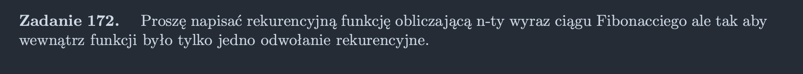

<picture>
  <source srcset="../../srt/zbior_zadan/172.png" media="(prefers-color-scheme: light)">
  <source srcset="../../srt/zbior_zadan/black_172.png" media="(prefers-color-scheme: dark)">
  
</picture>

```python
def fibonacci(n, a=0, b=1):
    """
    Rekurencyjna wersja pętli for, która wykonuje się, dopóki n jest większe niż 0,
    z możliwością ustawienia dwóch początkowych elementów ciągu.
    Domyślne wartości a=0 i b=1 odpowiadają pierwszym dwóm wyrazom ciągu Fibonacciego.
    """
    return fibonacci(n - 1, b, a + b) if n > 0 else a

```